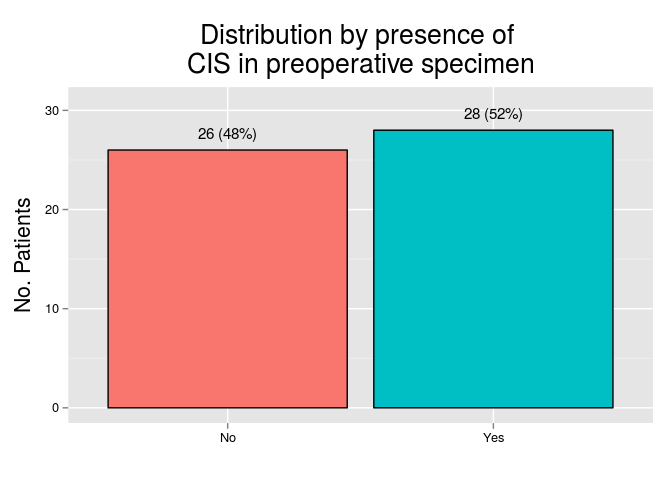

# Descriptive statistics

In this section we will describe the dataset, including patient's clinical features, preoperative and surgical data, pathologic features of the tumor, as well as preoperative and posoperative treatment, and patient's outcome. For this section we will use the full dataset (N = 55). This dataset include all cases that were used for building the tissue microarrays. Data for this section were obtain from medical charts and pathology reports.

                                  
