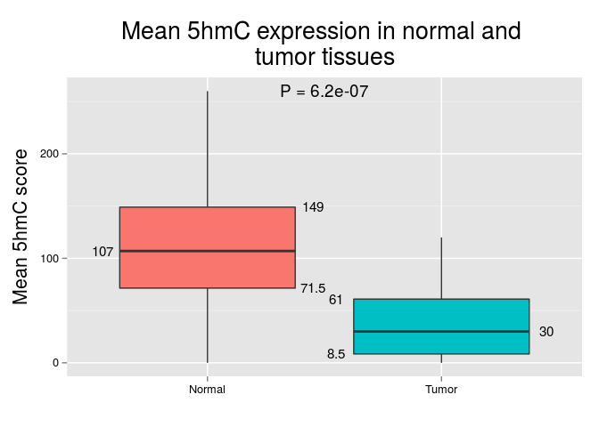
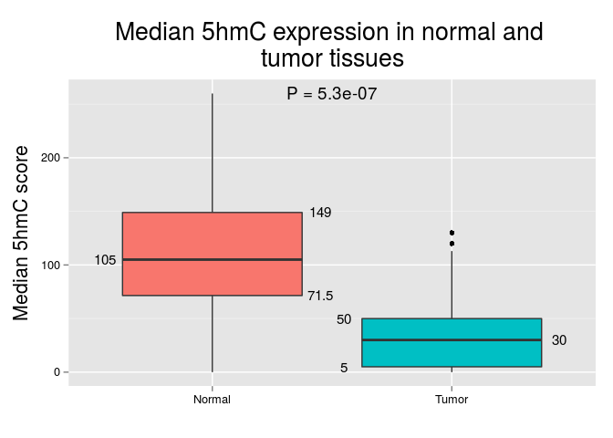
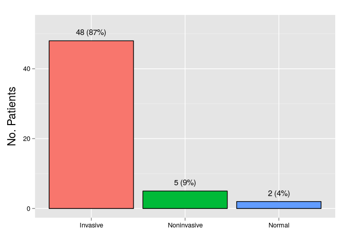
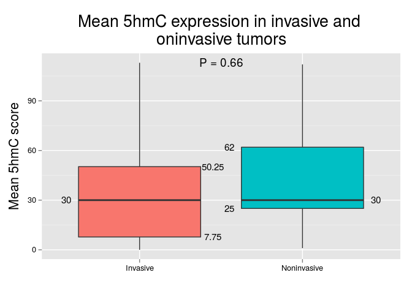
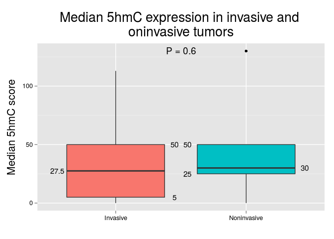

# Expression in tumor and nontumor tissues

In this section we will compare 5hmC H-scores as they were estimated in paired (i.e, form the sama surgical specimen) normal (i.e., histologically-normal urothelium) and tumor (both invasive and noninvasive) tissues. For this we will use the full dataset. Comparisons were made using the Wilcoxon signed rank test.

  

***

## 5hmC expression in invasive and noninvasive tumors
In addition, we will compare mean and median 5hmC scores between noninvasive and invasive tumors. Mean and median H-scores will be obtained from `t.5hmc.m` and `t.5hmc.med` (respectively), using `spot.dx` to identify which cases corresponded to noninvasive or invasive tumors. Regarding the latter, in some cases there was a discrepancy between the diagnosis given in the pathology report (as specified in `histo.dx`) and what was found at the TMA spot (specified in `spot.dx`). The following plot shows what was found at the TMA spots.

 

Thus, for the next comparisons and plots we will use only the `Invasive` and `Noninvasive` cases. Comparisons were made using the Mann-Whitney U test.

  

***
