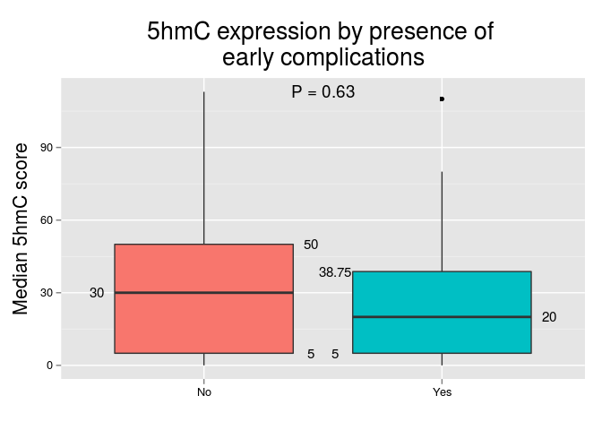

# Expression and Outcome

For this section we will use 3 different approaches for evaluating the association of 5hmC and outcome: 1) using 5hmC H-scores; 2) categorizing 5hmC expression in low/high levels using the median as the cutoff point; 3) categorizing 5hmC expression in low/high levels using the Q3 as the cutoff point.

Only invasive cases will be consider from now on, as observed at the TMA spot (i.e., `spot.dx == Invasive`). For age (numeric variable) we will use the median to define younger and older age groups.

The number of invasive cases is N = 48. Also, only median H-scores will be consider for analysis.

## Approach #1
In this approach we will compare 5hmC `H-scores` against clinicopathologic features and outcome. Comparisons will be made using the Mann-Whitney U test. 

            

***

## Approach # 2
In this approach we will compare 5hmC levels (categorizing 5hmC expression in low/high levels using the `median` as the cutoff point) against clinicopathologic features and outcome. Comparisons will be made using the Fisher's exact test.

            

***

## Approach # 3
In this approach we will compare 5hmC levels (categorizing 5hmC expression in low/high levels using the `upper tertile` as the cutoff point) against clinicopathologic features and outcome. Comparisons will be made using the Fisher's exact test.

            

***
