# Expression and Survival

In this section we will plot survival curves for overall mortality and cancer-related mortality according to clinicopathologic features and 5hmC expression, categorizing 5hmC expression in low/high levels using as cutoff points: 1) the median; 2) the upper tertile. Only invasive cases will be consider, as observed at the TMA spot (i.e., `spot.dx == Invasive`). For age (numeric variable) we will use the median to define younger and older age groups.

We will use `follow-up from cystectomy` for the time-to-event analysis.

***

## Clinicopathologic features and survival
In this section we will plot `Kaplan-Meier curves` for overall mortality and cancer-related mortality considering clinicopathologic features. We will compare survival curves using the `log-rank test`.

### Overall mortality
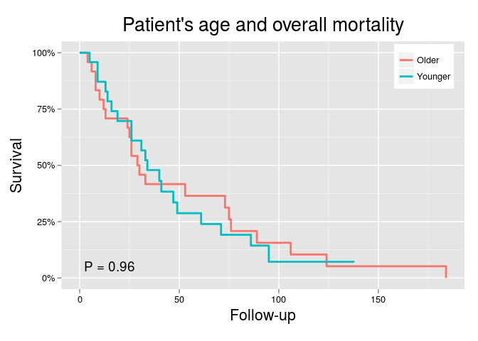 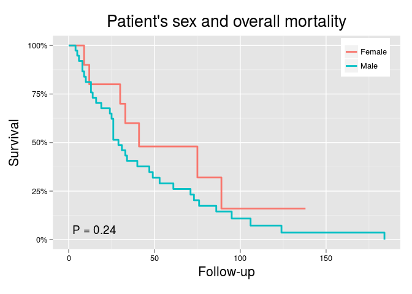 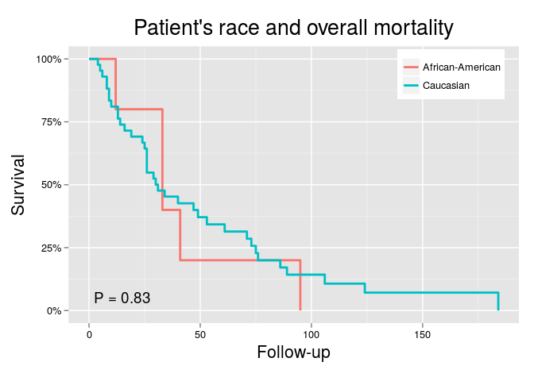 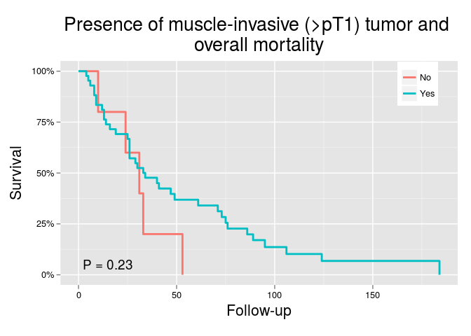 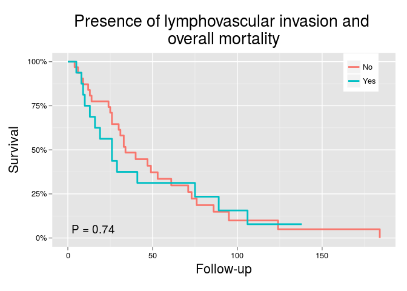 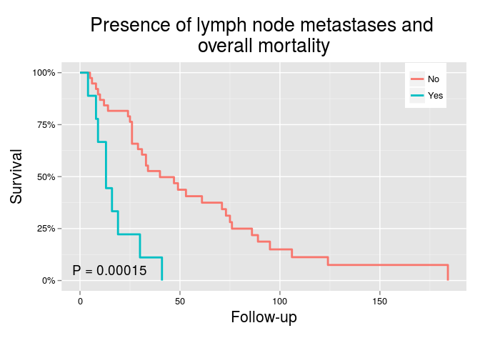 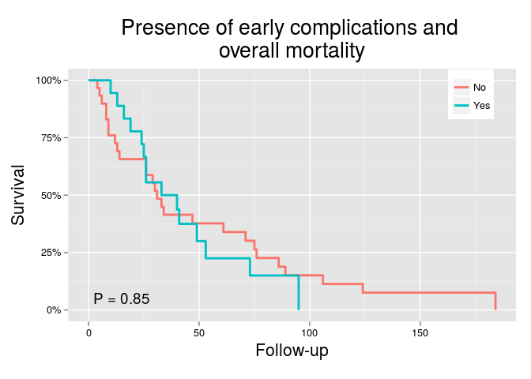 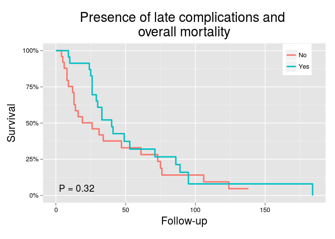 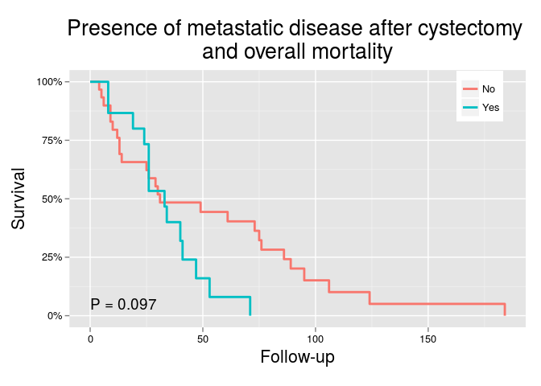 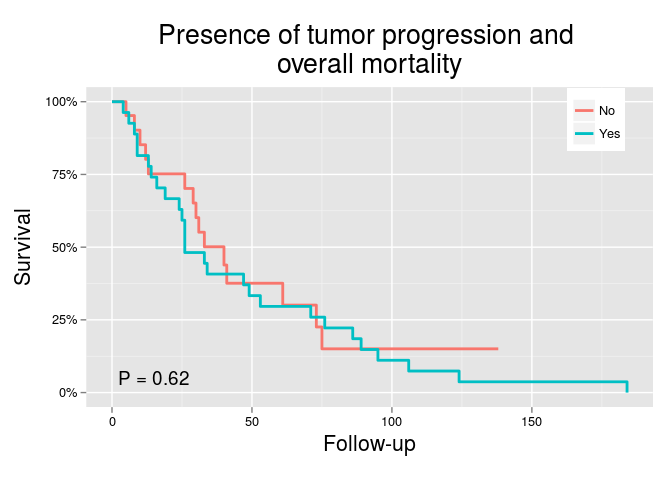 

***

### Cancer-related mortality
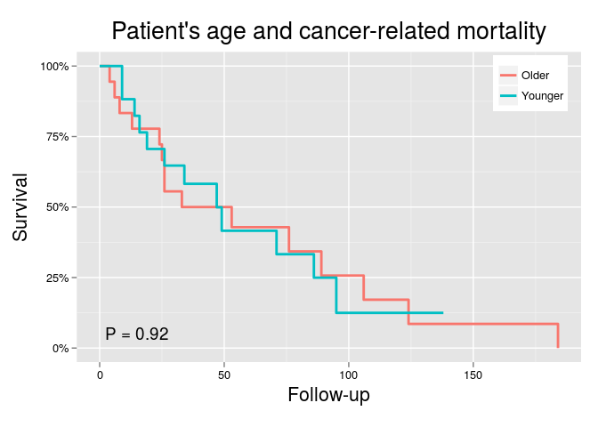 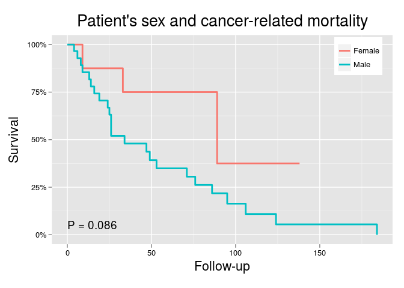 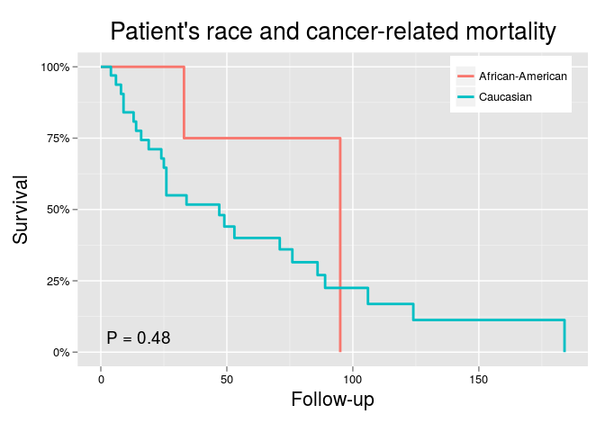 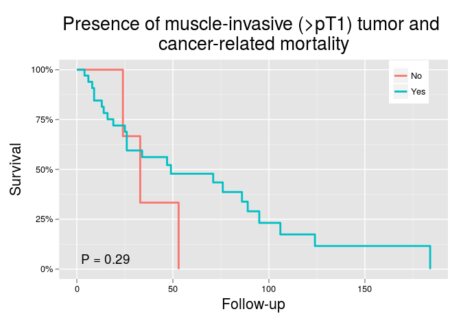 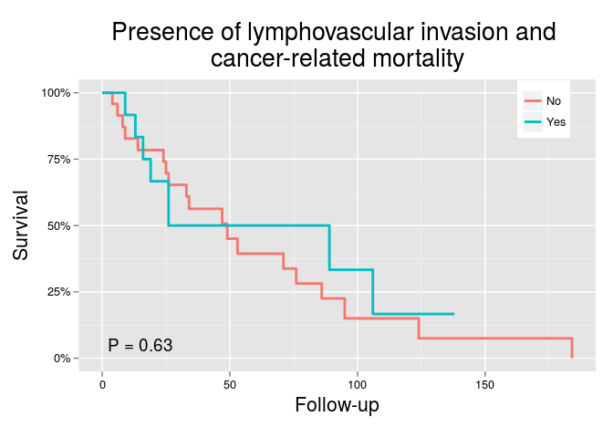 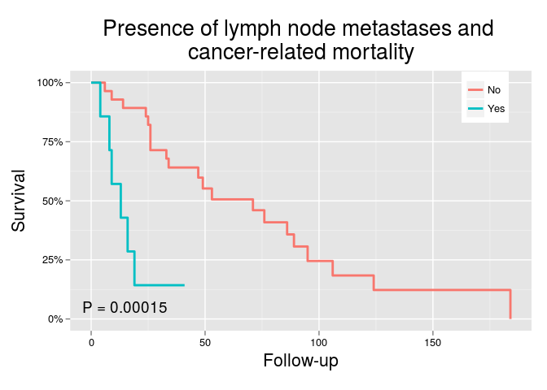 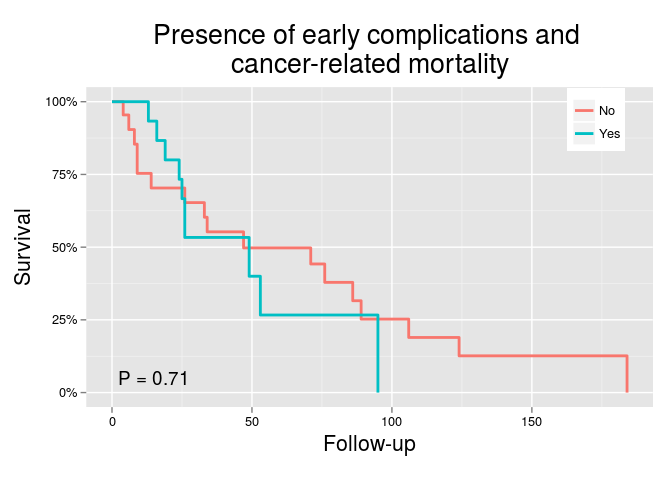 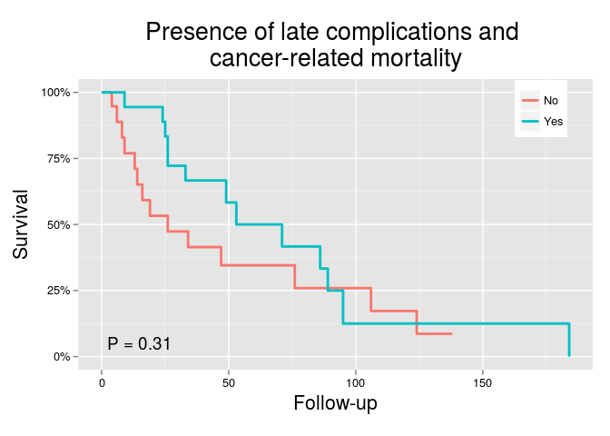 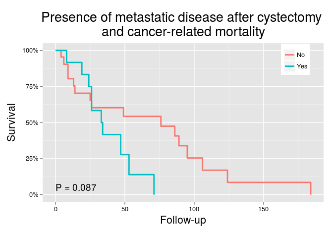 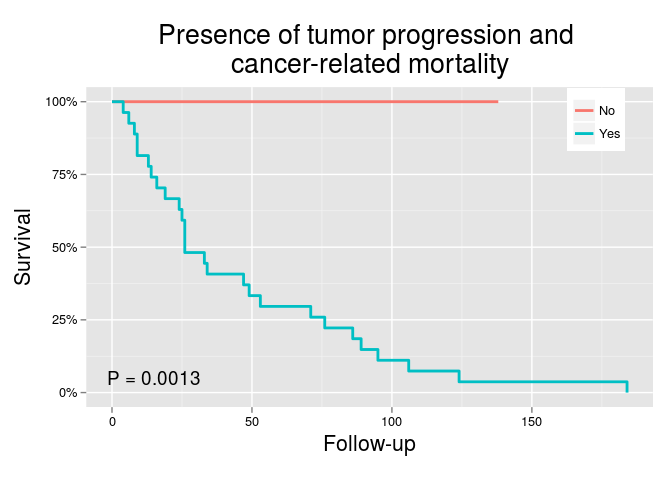 

## 5hmC levels and survival: Approach #1
In this approch we will plot `Kaplan-Meier curves` for overall mortality and cancer-related mortality using the `median` H-score as the cutoff point for defining low/high 5hmC levels. We will compare survival curves using the `log-rank test`.

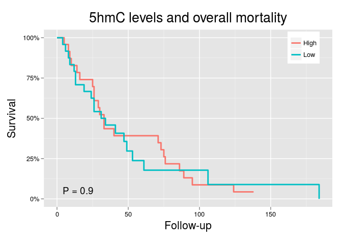 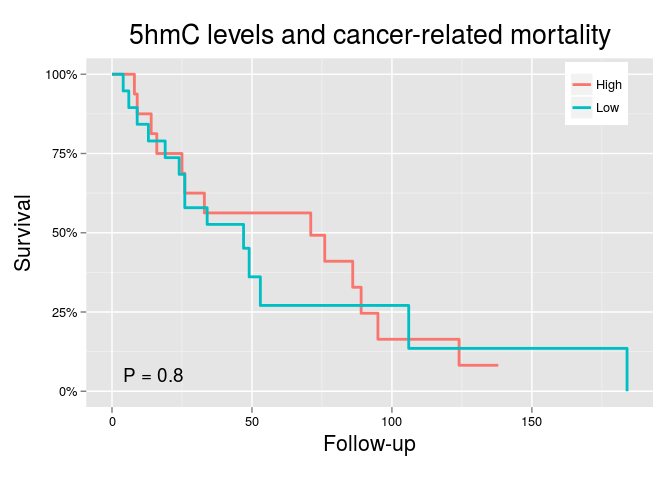 

***

## 5hmC levels and survival: Approach #2
In this approch we will plot `Kaplan-Meier curves` for overall mortality and cancer-related mortality using the upper tertile `Q3` H-score as the cutoff point for defining low/high 5hmC levels. We will compare survival curves using the `log-rank test`.

  

***
